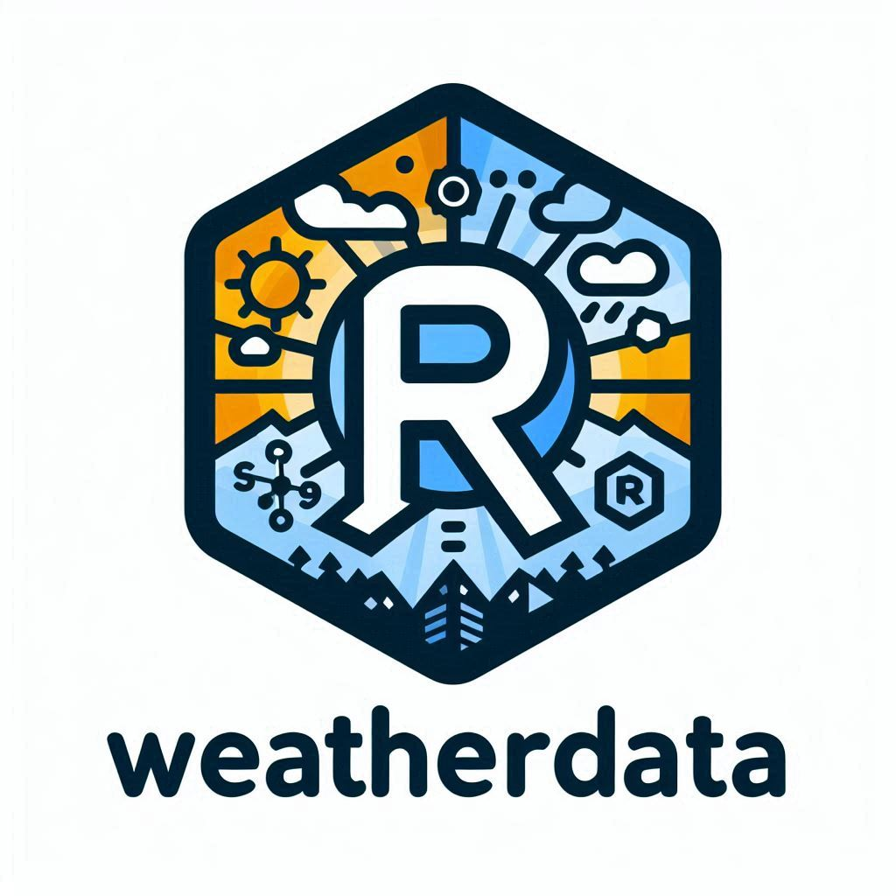

<!-- README.md is generated from README.Rmd. Please edit that file -->

# WeatherData 

<!-- badges: start -->

[](https://lifecycle.r-lib.org/articles/stages.html#experimental)
[](https://app.codecov.io/gh/BMilesRouillon/weatherdata)
[](https://github.com/BMilesRouillon/weatherdata/actions/workflows/R-CMD-check.yaml)

<!-- badges: end -->

## Welcome

Hello, we are Facundo and Benjamin, and we welcome you to our package,
WeatherData. This package was created with the aim of assisting users in
performing calculations related to meteorological phenomena.

## Why We Created It?

This package was developed because many people, including ourselves,
faced challenges in performing meteorological calculations, and we
decided to create a solution for this. One day, we embarked on this
project, which is unique in the world and crafted with exceptional care
and quality. We hope you enjoy it and that it assists you with the
calculations you need.

## Installation

You can install the development version of weatherdata from
[GitHub](https://github.com/) with:

``` r
# install.packages("pak")
pak::pak("BMilesRouillon/weatherdata")
```

## Library

This is a basic example which shows you how to solve a common problem:

``` r
library(weatherdata)
## basic example code
```

## Example with celcius to fahrenheit

``` r
celcius_to_fahrenheit(20)
#> [1] 93.6
```

## Example with fahrenheit to celcius

``` r
fahrenheit_to_celcius(50)
#> [1] 10
```

## Example meteorological summary

``` r
get_meteorological_summary("NH0046")
#> Error in get_meteorological_summary("NH0046"): no se pudo encontrar la función "get_meteorological_summary"
```

## Getting Help

If you encounter a bug or would like to request a new feature, please
begin by reviewing our [issue
tracker](https://github.com/BMilesRouillon/weatherdata/issues) to see if
the issue has already been reported. If it has not, you may submit a new
issue on GitHub. Please include a detailed description of the problem,
steps to reproduce it, a minimal reproducible example, and information
about your environment (such as R version, operating system, and package
version).

For general inquiries or further discussion, feel free to reach out via
our support email.

- bmiles@mail.austral.edu.ar

- frubiolo@mail.austral.edu.ar

We are dedicated to continually enhancing weatherdata and greatly value
your feedback and participation.

Code of Conduct Please note that weatherdata is released with a
[Contributor Code of
Conduct.](https://www.contributor-covenant.org/version/1/2/0/code-of-conduct/)
By contributing to this project, you agree to follow its terms.
